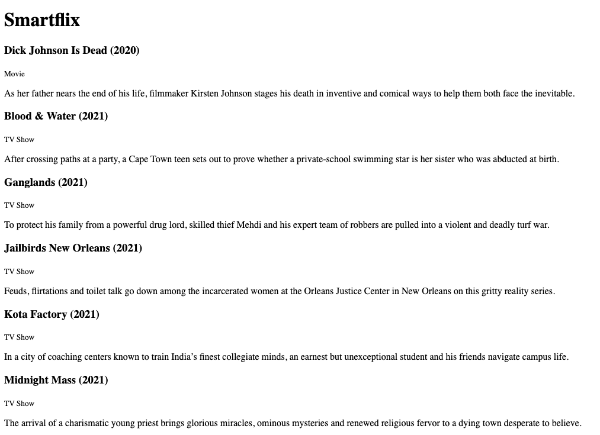

# Render shows to the homepage

## Outcomes

- Rails/File processing
- Rails/Haml

## Description

You have just set up a Rails application with a test-driven dummy view! 🎉

In this challenge, you will update the application so the root route renders the shows from the [provided CSV file](../training-data/netflix_titles.zip).

Here's how it should look by the end of this ticket:

## To complete this ticket, you will have to:

- [ ] Write a new acceptance test that asserts: when the user visits the homepage, the page content should include each show title in the [provided CSV file](../training-data/netflix_titles.csv).
- [ ] Configure your Rails app to use [Haml](https://haml.info/) for the views.
- [ ] Create a new controller to show all shows. Make sure you're following the [Rails naming conventions](https://guides.rubyonrails.org/action_controller_overview.html)!
- [ ] Create a new route so that users visiting the root of your application are directed to the index action of your new controller. Make sure you're following the [Rails routing conventions](https://guides.rubyonrails.org/routing.html)!
- [ ] Pass the acceptance test by displaying all shows from the [provided CSV file](../training-data/netflix_titles.zip) file.

## Tips
- There are a lot of shows in the [provided CSV file](../training-data/netflix_titles.zip)! You may need to limit the number you render to the view.