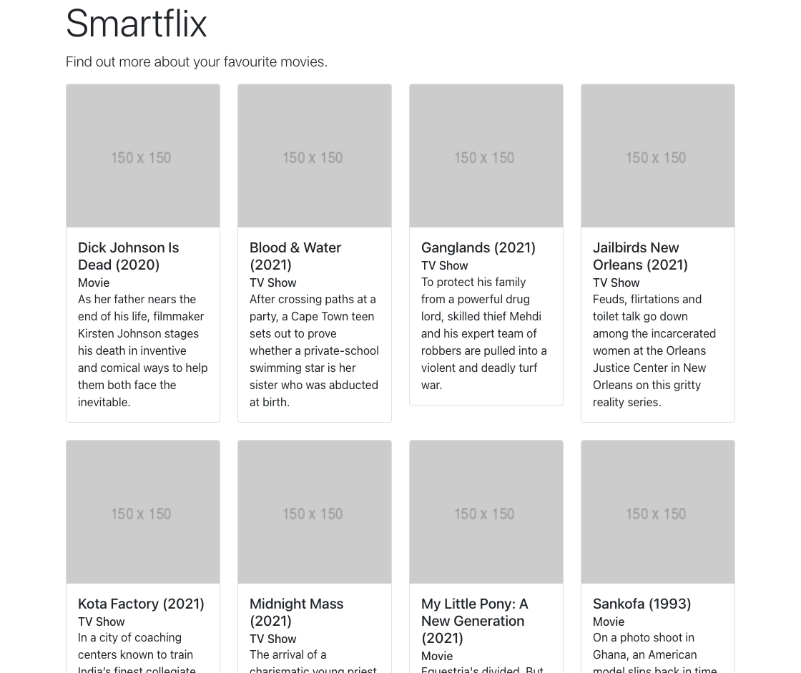

# Style the homepage

- Rails/Bootstrap
- Rails/Sass

In the previous ticket, you created an unstyled homepage that loads and displays data from the [provided CSV file](../training-data/netflix_titles.zip).

In this ticket, you will style that homepage using CSS, Sass, and Bootstrap. Here's what it will look like:

## To complete this challenge, you will have to:

- [ ] Configure your Rails app to use [Sass](https://mentalized.net/journal/2019/10/19/use-sass-modules-in-rails/) as a pre-processor.
- [ ] Reset any automatic browser styles with a [CSS reset](https://www.boag.online/blog/css-reset).
- [ ] Add the [Bootstrap](https://getbootstrap.com/) CSS framework to your application.
- [ ] Style the homepage so it matches the screenshot above. Aim for perfection!
- [ ] When you submit a Pull Request for this ticket, include a screenshot of your app's homepage.

## Tips

- Consider using [Placeholder.com](https://placeholder.com) for placeholder images.
- You can have your browser auto-refresh on style changes if you use the [Webpacker Dev Server](https://guides.rubyonrails.org/webpacker.html#running-webpacker-in-development).
- Make sure you use [Bootstrap components](https://getbootstrap.com/docs/5.1/components/card/) for most of the heavy lifting.