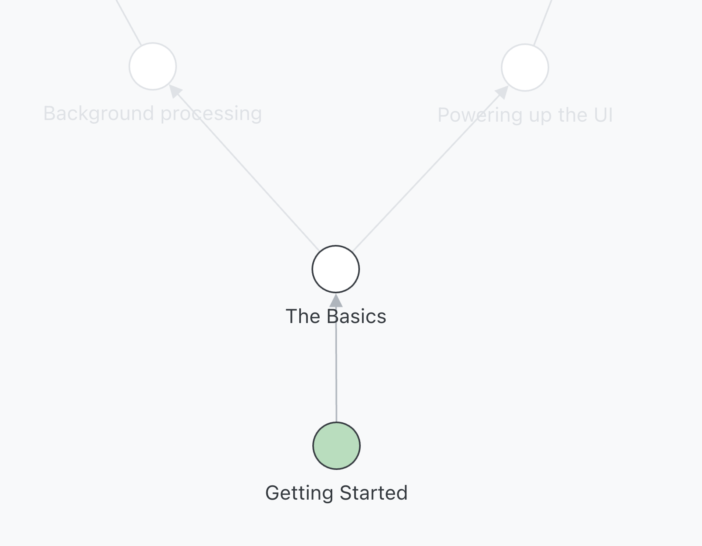

# Smart Academy Curricula

The curriculum for taking a new Smart dev from zero to trainee to junior. This is a template repo, which is duplicated by learners who have an invite from [Techmap](https://graph.techmap.app).

## Your learning journey

Smart developers join the company, and go through two [gated](./training/README.md) stages:

1. **[Onboarding](./onboarding/README.md)**. After completing onboarding, they are a **Trainee Developer**.
2. **[Training](./training/README.md)**. After completing training, they are a **Junior Developer**.

> Check out the links for more details.

## Getting started

This repo works alongside [Techmap](https://graph.techmap.app) to give you a ready-to-go workspace repo on Github and a clear sequence of issues to work through:

Issues are organised into projects, which are represented on a graph in Techmap:

To start a project:

1. Get an invite from your engineering manager to [Techmap](https://graph.techmap.app).
2. When you log in, you will be prompted to duplicate this repository along with various projects and issues.
3. Click on any unlocked node to begin the project.

Each project contains several issues. To complete a project:

1. Pick a ticket from the list of issues in Github.
2. Create a new branch for the ticket, **starting the branch name with the issue number**. For instance, the branch for issue `#1 Create Rails Application` could be called `1-create-rails-app`, or `1-setup-rails`, or `1-do-the-thing`. So long as it starts with the issue number, your progress will be tracked.
3. Complete the ticket.
4. Create a pull request to your `main` branch for the ticket. This will promote the ticket to the "in Review" column, which triggers a notification in the #coaching Slack channel.
5. Get a review from one of the [coaches](./coaching/README.md). Once approved, merge the issue to `main` and go to step 1 :slightly_smiling_face:

Once you have completed all issues in a project, head to [Techmap](https://graph.techmap.app) to complete the activity, give a short reflection of the project overall (and some feedback), and pick your next project.